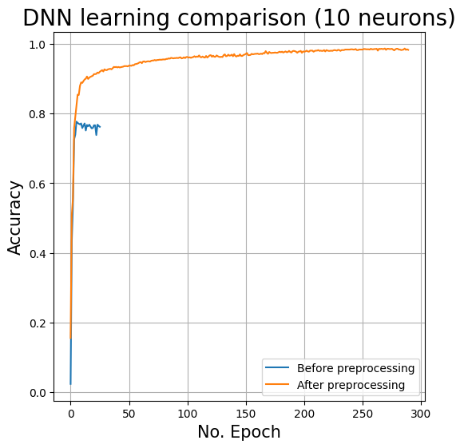
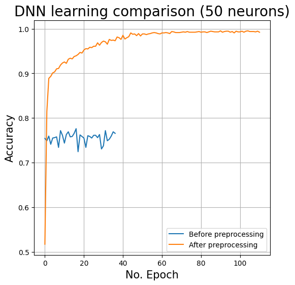

# Data-Mining-assignment-1

Preprocessing is a module created as an assignment for Data Mining Classes in Poznan University of Technology. It's goal is to provide neccessery tools to pre-proccess the data from chosen dataset before using it as a training data for machine learning algorithms like dnn or som.

---
### Team: Data Dwarfs

- Dawid Siera
- Anatol Kaczmarek
- Deniz Aksoy
- Marcin Leszczyński

---
### Code Structure
```
preprocessing/
│
├── preprocessing.py       # Data preprocessing functions and classes.
├── selector.py            # Feature and data point selection routines.
├── extractor.py           # Data extraction from various sources.
├── benchmarks/            # Subpackage for benchmarks and model implementations.
│   ├── __init__.py        # Initializes Python package structure.
│   ├── _benchmark_abc.py  # Benchmarking scripts for performance evaluation.
│   ├── dnn.py             # Deep Neural Network model implementations.
│   ├── classififier.py    # Simple Classification algorithm implementation.
│   └── som.py             # Self-Organizing Map algorithm implementation.
├── vizualization/         # Subpackage for data vizualization.
│   ├── __init__.py        # Initializes Python package structure.
│   ├── data_analysis.py   # Vizualization for analysis of the data
│   └── two_dimensional.py # Vizualizations of 2 chosen dimensions of dataset.
└── __init__.py            # Initializes Python package structure.
```

---
### Installation:
To use the code from repository we recomend one of two methods. For any of chosen methods first it's required to clone repository

1. Clone from github
```sh
git clone https://github.com/Dawid64/Data-Mining-assignment-1.git
```
- 2 A) Use module locally by importing features directly from it.

- 2 B) Download code via pip while in repository and then use it from your python as any other library
```sh
pip install .
```
---
### How to use:
There are 2 jupiter notebooks that will introduce you to this package:
`notebook_1_clf.ipynb` and `notebook_2_dnn.ipynb`.

I recomend starting with them with dataset `spaceship-titanic` from kaggle: https://www.kaggle.com/competitions/spaceship-titanic/data 

---
Here are some results of our work:




---
### Example usage:
Preprocessing dataset and benchmarking it on DNN
```py
import pandas as pd
import preprocessing as pr
dataset = pd.read_csv('Your_dataset.csv')
selector = pr.VARSelector()
extractor = pr.PCAExtractor(num_components=8, target='Your_Target')
preprocessing = pr.Preprocessing(dataset, target='Your_Target',
                                 selector=selector, extractor=extractor)
new_dataset = preprocessing.preprocess()
dnn = pr.benchmarks.DNNBenchmark()
dnn.evaluate(new_dataset, target='Your_Target')
```